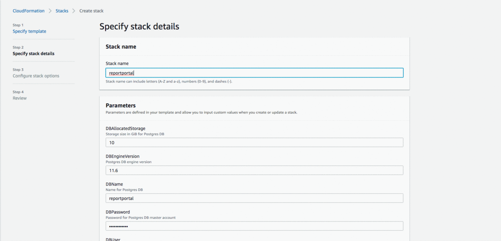
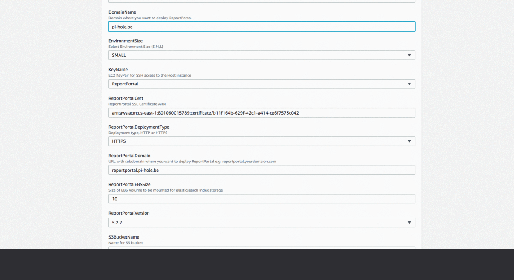
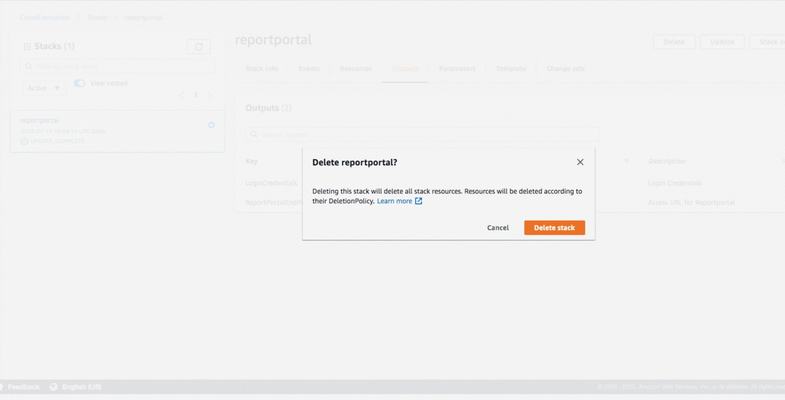

# ReportPortal with AWS CloudFormation
Deploy and Upgrade ReportPortal using AWS CloudFormation

## Blog Link
![[]https://miro.medium.com/max/1000/1*xTXIQI4LyQRV5SaSScmgOA.png](https://medium.com/@chhatbarjignesh/deploy-reportportal-in-aws-with-aws-cloudformation-cd6553e27f74)

## Create Stack using Console

## Update Stack Using Console

## Update Stack Using Console
